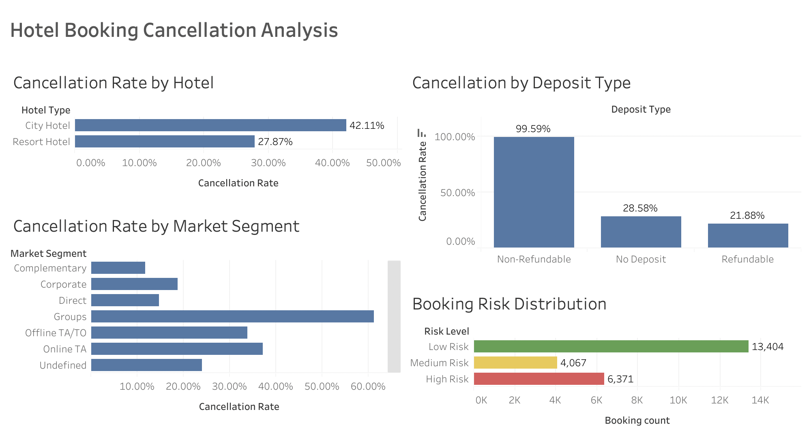

# Hotel Booking Cancellation Analysis & Prediction

## Overview
I downloaded the Hotel Demand Data from Kaggle and initiated this project to analyze hotel booking data to understand the drivers of reservation cancellations and builds a machine learning model to predict cancellation risk.

The project combines:
- exploratory data analysis
- machine learning prediction
- dashboard visualization

## Dataset
Hotel Booking Demand Dataset  
Source: https://www.kaggle.com/datasets/jessemostipak/hotel-booking-demand

The dataset contains over 119,000 hotel reservations with information on booking behavior, customer segments, and cancellation outcomes.

## Objectives
- Identify factors that influence hotel booking cancellations
- Build a machine learning model to predict cancellation probability
- Visualize patterns in booking behavior and risk using Tableau

## Methods

### Data Processing
- handled missing values
- removed invalid guest records

### Machine Learning Model
A **Random Forest classification model** was trained to predict whether a booking will be canceled.

Model performance:
- Accuracy: ~88%

### Visualization
A Tableau dashboard was built to visualize key booking patterns and model outputs.

Key dashboard components:
- Cancellation Rate by Hotel Type
- Cancellation Rate by Deposit Policy
- Cancellation Rate by Market Segment
- Lead Time vs Cancellation Probability
- Booking Risk Distribution

## Key Insights
- City hotels show significantly higher cancellation rates than resort hotels.
- Bookings made far in advance show greater cancellation risk.
- Group bookings have a high cancellation rate, probably because the group would make multiple reservations at a time.

## Dashboard Preview

## Technologies Used
- Python
- Pandas
- Scikit-learn
- Tableau

